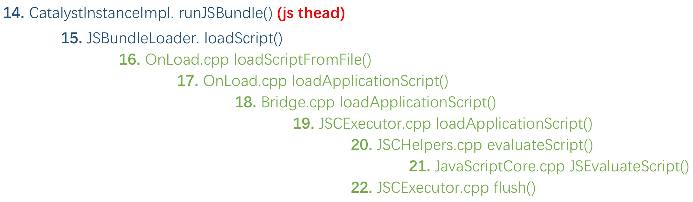

# ReactNative Android通信原理

本文基于release 0.29,从源码角度剖析react native for android的java<=>js通信机制。

## 整体结构

rn分为三大模块,java层、js层和bridge,java和js通过bridge实现通信,由于java不能直接调用JavaScriptCore,bridge层由C/C++实现,整体结构图如下。<br>

<br>

## 基本原理

结构图如下<br>

<br>

## 先来看rn初始化的过程, java => js

### 初始化bridge

<br>

#### 1. ReactRootView.startReactApplication()
```java
  public void startReactApplication(
      ReactInstanceManager reactInstanceManager,
      String moduleName,
      @Nullable Bundle launchOptions) {
    ......
    if (!mReactInstanceManager.hasStartedCreatingInitialContext()) {
      mReactInstanceManager.createReactContextInBackground();
    }
    ......
  }
```

#### 2. ReactInstanceManagerImpl.createReactContextInBackground()
```java
  public void createReactContextInBackground() {
    ......
    mHasStartedCreatingInitialContext = true;
    recreateReactContextInBackgroundInner();
  }
```
经过几次派发,在AsyncTask中创建react context.

#### 3. ReactInstanceManagerImpl.ReactContextInitAsyncTask.doInBackground()
```java
    protected Result<ReactApplicationContext> doInBackground(ReactContextInitParams... params) {
      ......
        JavaScriptExecutor jsExecutor =
            params[0].getJsExecutorFactory().create(
              mJSCConfig == null ? new WritableNativeMap() : mJSCConfig.getConfigMap());
        return Result.of(createReactContext(jsExecutor, params[0].getJsBundleLoader()));
      ......
    }
```

#### 4. ReactInstanceManagerImpl.createReactContext()
这个方法很长,主要是创建native/js module,创建CatalystInstance实例,并加载jsbundle,下面一步步分析。<br>
```java
  private ReactApplicationContext createReactContext(
      JavaScriptExecutor jsExecutor,
      JSBundleLoader jsBundleLoader) {
    NativeModuleRegistry.Builder nativeRegistryBuilder = new NativeModuleRegistry.Builder();
    JavaScriptModuleRegistry.Builder jsModulesBuilder = new JavaScriptModuleRegistry.Builder();

    final ReactApplicationContext reactContext = new ReactApplicationContext(mApplicationContext);
    try {
      CoreModulesPackage coreModulesPackage =
          new CoreModulesPackage(this, mBackBtnHandler, mUIImplementationProvider);
      processPackage(coreModulesPackage, reactContext, nativeRegistryBuilder, jsModulesBuilder);
    } finally {
      Systrace.endSection(Systrace.TRACE_TAG_REACT_JAVA_BRIDGE);
    }

    for (ReactPackage reactPackage : mPackages) {
      try {
        processPackage(reactPackage, reactContext, nativeRegistryBuilder, jsModulesBuilder);
      } finally {
        Systrace.endSection(Systrace.TRACE_TAG_REACT_JAVA_BRIDGE);
      }
    }

    NativeModuleRegistry nativeModuleRegistry;
    try {
       nativeModuleRegistry = nativeRegistryBuilder.build();
    } finally {
    }

    CatalystInstanceImpl.Builder catalystInstanceBuilder = new CatalystInstanceImpl.Builder()
        .setReactQueueConfigurationSpec(ReactQueueConfigurationSpec.createDefault())
        .setJSExecutor(jsExecutor)
        .setRegistry(nativeModuleRegistry)
        .setJSModuleRegistry(jsModulesBuilder.build())
        .setJSBundleLoader(jsBundleLoader)
        .setNativeModuleCallExceptionHandler(exceptionHandler);

    final CatalystInstance catalystInstance;
    try {
      catalystInstance = catalystInstanceBuilder.build();
    } finally {
    }

    try {
      catalystInstance.getReactQueueConfiguration().getJSQueueThread().callOnQueue(
        new Callable<Void>() {
          @Override
          public Void call() {
            try {
              catalystInstance.runJSBundle();
            } finally {
            }
            return null;
          }
        }).get();
    } catch (InterruptedException | ExecutionException e) {
      throw new RuntimeException(e);
    }

    return reactContext;
  }
```
NativeModuleRegistry和JavaScriptModuleRegistry为模块配置表, java和js持有相同的模块配置表,以实现相互调用(后面分析)。模块由CoreModulesPackage的createNativeModules()和createJSModules()方法创建。<br><br>

#### 5. 创建native/js module
```java
processPackage(coreModulesPackage, reactContext, nativeRegistryBuilder, jsModulesBuilder);和
processPackage(reactPackage, reactContext, nativeRegistryBuilder, jsModulesBuilder);
```
分别将系统模块和自定义模块保存到NativeModuleRegistry和JavaScriptModuleRegistry中。下面看CatalystInstanceImpl的初始化<br>

#### 6. CatalystInstanceImpl初始化
主要做了2件事情:<br>
1. 创建ui/native module/js module的消息队列<br>
2. 初始化bridge
```java
  private CatalystInstanceImpl(
      final ReactQueueConfigurationSpec ReactQueueConfigurationSpec,
      final JavaScriptExecutor jsExecutor,
      final NativeModuleRegistry registry,
      final JavaScriptModuleRegistry jsModuleRegistry,
      final JSBundleLoader jsBundleLoader,
      NativeModuleCallExceptionHandler nativeModuleCallExceptionHandler) {
    FLog.d(ReactConstants.TAG, "Initializing React Bridge.");
    mReactQueueConfiguration = ReactQueueConfigurationImpl.create(
        ReactQueueConfigurationSpec,
        new NativeExceptionHandler());
    ......

    try {
      mBridge = mReactQueueConfiguration.getJSQueueThread().callOnQueue(
          new Callable<ReactBridge>() {
            @Override
            public ReactBridge call() throws Exception {
              Systrace.beginSection(Systrace.TRACE_TAG_REACT_JAVA_BRIDGE, "initializeBridge");
              try {
                return initializeBridge(jsExecutor);
              } finally {
                Systrace.endSection(Systrace.TRACE_TAG_REACT_JAVA_BRIDGE);
              }
            }
          }).get();
    } catch (Exception t) {
      throw new RuntimeException("Failed to initialize bridge", t);
    }
  }
```

#### 7. 创建ui/native module/js module的消息队列
ReactQueueConfigurationImpl.create()中创建了3个消息队列, 其中ui queue为主线程queue,native module和js module queue都在创建的子线程中。所以要特别注意: native module和js module都是在子线程执行的,在自定义native module中,如需要更新ui,需要切换到主线程中执行。

#### 8. 初始化bridge
可以看出bridge的初始化是在前一步创建的js线程中进行的。<br>
```java
mBridge = mReactQueueConfiguration.getJSQueueThread().callOnQueue(
          new Callable<ReactBridge>() {
            @Override
            public ReactBridge call() throws Exception {
              Systrace.beginSection(Systrace.TRACE_TAG_REACT_JAVA_BRIDGE, "initializeBridge");
              try {
                return initializeBridge(jsExecutor);
              } finally {
                Systrace.endSection(Systrace.TRACE_TAG_REACT_JAVA_BRIDGE);
              }
            }
          }).get();
```

#### 9. 设置bridge config
将java module配置表通过Bridge传入js层, 设置到全局变量__fbBatchedBridgeConfig中, buildModulesConfigJSONProperty()方法把native module转换成了json数据,包含了每个native module的method id和method name。 Bridge作为java层和native层的桥梁, 下面转入native层分析。
```java
  private ReactBridge initializeBridge(JavaScriptExecutor jsExecutor) {
    ......
    try {
      bridge.setGlobalVariable(
          "__fbBatchedBridgeConfig",
          buildModulesConfigJSONProperty(mJavaRegistry));
      bridge.setGlobalVariable(
          "__RCTProfileIsProfiling",
          Systrace.isTracing(Systrace.TRACE_TAG_REACT_APPS) ? "true" : "false");
    } finally {
      Systrace.endSection(Systrace.TRACE_TAG_REACT_JAVA_BRIDGE);
    }

    mJavaRegistry.notifyReactBridgeInitialized(bridge);
    return bridge;
  }

  public native void setGlobalVariable(String propertyName, String jsonEncodedArgument);
```

#### 10. native入口OnLoad.cpp
OnLoad.cpp是java层到native层的入口, initialize()中配置了映射关系。<br>
OnLoad.cpp的setGlobalVariable()调用了CountableBridge的setGlobalVariable(),而CountableBridge是Bridge的子类,下面看Bridge.cpp的实现。<br>
```C++
  extern "C" JNIEXPORT jint JNI_OnLoad(JavaVM* vm, void* reserved) {
    return initialize(vm, [] {
      ......
      registerNatives("com/facebook/react/bridge/ReactBridge", {
          makeNativeMethod("initialize", "(Lcom/facebook/react/bridge/JavaScriptExecutor;Lcom/facebook/react/bridge/ReactCallback;Lcom/facebook/react/bridge/queue/MessageQueueThread;)V", bridge::create),
          makeNativeMethod("loadScriptFromFile", bridge::loadScriptFromFile),
          makeNativeMethod("callFunction", bridge::callFunction),
          makeNativeMethod("invokeCallback", bridge::invokeCallback),
          makeNativeMethod("setGlobalVariable", bridge::setGlobalVariable),
          ......
      });
      ......
  }

  static void setGlobalVariable(JNIEnv* env, jobject obj, jstring propName, jstring jsonValue) {
    auto bridge = extractRefPtr<CountableBridge>(env, obj);
    bridge->setGlobalVariable(fromJString(env, propName), fromJString(env, jsonValue));
  }
```

#### 11. native bridge Bridge.cpp
Bridge.cpp只是简单的派发到JSExecutor中执行,从Bridge的构造函数中可以追踪到,JSExecutor由JSExecutorFactory创建,真正的实例为JSCExecutor,下面看JSCExecutor.cpp
```C++
void Bridge::setGlobalVariable(const std::string& propName, const std::string& jsonValue) {
  runOnExecutorQueue(*m_mainExecutorToken, [=] (JSExecutor* executor) {
    executor->setGlobalVariable(propName, jsonValue);
  });
}
```

#### 12. JSCExecutor.cpp
调用JavaScriptCore将prop设置到js的全局变量中, 到这里就完成了将native module配置表写入js全局变量__fbBatchedBridgeConfig中。
```java
void JSCExecutor::setGlobalVariable(const std::string& propName, const std::string& jsonValue) {
  auto globalObject = JSContextGetGlobalObject(m_context);
  String jsPropertyName(propName.c_str());

  String jsValueJSON(jsonValue.c_str());
  auto valueToInject = JSValueMakeFromJSONString(m_context, jsValueJSON);

  JSObjectSetProperty(m_context, globalObject, jsPropertyName, valueToInject, 0, NULL);
}
```

### 加载js bundle
现在加到第4步, 初始化好CatalystInstance后,下一步是加载js bundle,过程见下图<br>
<br>

#### 14. runJSBundle
同样在js线程中执行<br>
```java
  catalystInstance.getReactQueueConfiguration().getJSQueueThread().callOnQueue(
    new Callable<Void>() {
      @Override
      public Void call() {
        // RUN_JS_BUNDLE_END is in JSCExecutor.cpp
        Systrace.beginSection(Systrace.TRACE_TAG_REACT_JAVA_BRIDGE, "runJSBundle");
        try {
          catalystInstance.runJSBundle();
        } finally {
          // This will actually finish when `JSCExecutor#loadApplicationScript()` finishes
          Systrace.endSection(Systrace.TRACE_TAG_REACT_JAVA_BRIDGE);
        }
        return null;
      }
    }).get();

  public void runJSBundle() {
    ......
    try {
      mJSBundleLoader.loadScript(mBridge);
    } catch (JSExecutionException e) {
      mNativeModuleCallExceptionHandler.handleException(e);
    } finally {
    }
    mJSBundleHasLoaded = true;
  }
```
#### 15. JSBundleLoader.loadScript()
JSBundleLoader提供了3种加载js bundle的方法:<br>
1. 从assets中加载<br>
2. 从指定的file中加载<br>
3. 从网络中加载<br>
这里我们只关注从文件中加载的方式,其它2种方式本质上也一样。具体加载过程出C层实现<br>
```java
  public static JSBundleLoader createFileLoader(
      final Context context,
      final String fileName) {
    return new JSBundleLoader() {
      @Override
      public void loadScript(ReactBridge bridge) {
        if (fileName.startsWith("assets://")) {
          bridge.loadScriptFromAssets(context.getAssets(), fileName.replaceFirst("assets://", ""));
        } else {
          bridge.loadScriptFromFile(fileName, "file://" + fileName);
        }
      }
    ......
    };
  }
```

#### 16. OnLoad.cpp loadScriptFromFile()
和setGlobalVariable一样, 派发到Bridge.cpp中执行
```java
static void loadScriptFromFile(JNIEnv* env, jobject obj, jstring fileName, jstring sourceURL) {
  .......
  env->CallStaticVoidMethod(markerClass, gLogMarkerMethod, env->NewStringUTF("loadScriptFromFile_read"));
  loadApplicationScript(bridge, script, fromJString(env, sourceURL));
  if (env->ExceptionCheck()) {
    return;
  }
  env->CallStaticVoidMethod(markerClass, gLogMarkerMethod, env->NewStringUTF("loadScriptFromFile_exec"));
}
```

#### 17. OnLoad.cpp loadApplicationScript()
```java
static void loadApplicationScript(
    const RefPtr<CountableBridge>& bridge,
    const std::string& script,
    const std::string& sourceUri) {
  try {
    bridge->loadApplicationScript(script, sourceUri);
  } catch (...) {
    translatePendingCppExceptionToJavaException();
  }
}
```

#### 18. Bridge.cpp loadApplicationScript()
派发到JSCExecutor.cpp中
```java
void Bridge::loadApplicationScript(const std::string& script, const std::string& sourceURL) {
  m_mainExecutor->loadApplicationScript(script, sourceURL);
}
```

#### 19. JSCExecutor.cpp loadApplicationScript()
调用JSCHelpers.cpp evaluateScript(),执行完后通过flush回调到java层。
```java
void JSCExecutor::loadApplicationScript(
    const std::string& script,
    const std::string& sourceURL) {
  ......
  evaluateScript(m_context, jsScript, jsSourceURL);
  flush();
  ReactMarker::logMarker("RUN_JS_BUNDLE_END");
  ReactMarker::logMarker("CREATE_REACT_CONTEXT_END");
}

void JSCExecutor::flush() {
  ......
  std::string calls = m_flushedQueueObj->callAsFunction().toJSONString();
  m_bridge->callNativeModules(*this, calls, true);
}
```

#### 20. JSCHelpers.cpp evaluateScript()
调用JavaScriptCore的evaluate方法,加载script。
```java
JSValueRef evaluateScript(JSContextRef context, JSStringRef script, JSStringRef source) {
  JSValueRef exn, result;
  result = JSEvaluateScript(context, script, NULL, source, 0, &exn);
  ......
  return result;
}
```